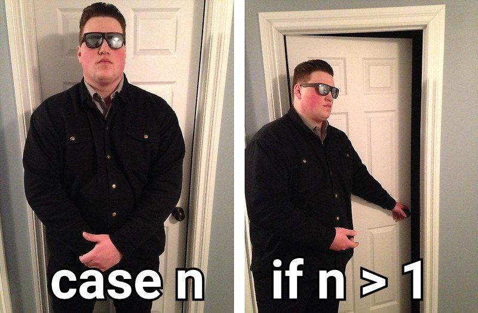

# Pattern Matching finalmente chega no Python 3.10. E daí?

_"Pattern matching"_, ou _"correspondência de padrões"_ como é conhecido no Brasil. Algumas pessoas já conhecem; praticamente todas as que conhecem, amam. Compreensível: pattern matching oferece uma maneira concisa e elegante de verificar e validar valores e objetos em nossos programas.  
Por ser uma funcionalidade que essencialmente nasceu com linguagens cujo paradigma principal é o funcional, o pattern matching é algo que já podia ser encontrado em linguagens como Haskell, Scala, Elixir, OCaml e F# (entre outras). Se tornou tão popular como uma funcionalidade que é consistentemente apreciada pela vasta maioria dos programadores que linguagens não-primariamente funcionais começaram a adotá-la, como Rust e, agora, Python.

Então vamos lá. Por que tanto barulho quando se fala de pattern matching? Qual é o motivo do _hype_? Afinal de contas, como algumas pessoas dizem...

## É tipo um switch/case, né?
Bem, sim e não. "Sim" porque definitivamente pode ser usado como um switch/case; "não" porque vai muito, muito além de um _simples_ switch/case.
Para exemplificar, revisitemos alguns exemplos de switch/case em uma linguagem similarmente popular: JavaScript.  
Pelo bem da simplicidade, tentaremos manter os exemplos simples o suficiente para que não haja uma necessidade adicional de aprender sobre a linguagem em si.

> Todos os exemplos de JavaScript foram testados no console do navegador Google Chrome, versão 90.0.4430.212

Vamos supor que queiramos implementar um simples fatorial usando switch/case e recursividade em JavaScript. Precisamos:
- receber um número inteiro como argumento,
- verificar o seu valor:
  - se for 0 ou 1, retornamos 1.
  - caso contrário, sendo n, retornamos n * factorial(n-1).

Em um primeiro rascunho, temos:
```js
function factorial(n) {
    switch (n) {
        case 0:
            return 1;

        case 1:
            return 1;

        default:
            return n * factorial(n-1);
    }
}
```

O equivalente usando pattern matching em Python seria:
```python
def factorial(n):
    match n:
        case 0:
            return 1
        
        case 1:
            return 1
        
        case _:
            return n * factorial(n-1)
```

A primeira diferença que podemos observar é a palavra `match`: em vez de `switch`, como nas linguagens que usam switch/case, o pattern matching do Python usa `match`. Fora isso, em vez do `default`, temos `case _` como o "pega tudo" do `match`. Pythonistas já conhecem e usam o underscore (`_`) quando querem ignorar o valor; em uma instrução `match`, ele serve exatamente o mesmo propósito.

Certo, em ambos os casos nós temos dois `return 1`. Em JavaScript é fácil resolver: só precisamos nos aproveitar do _fall-through_, ou efeito cascata do `switch`:

```js
function factorial(n) {
    switch (n) {
        case 0:
        case 1:
            return 1;

        default:
            return n * factorial(n-1);
    }
}
```

Analogamente, o `match` do Python nos oferece o operador _or_. Com este operador, podemos capturar um _ou_ outro padrão.

```python
def factorial(n):
    match n:
        case 0 | 1:
            return 1

        case _:
            return n * factorial(n-1)
```

E da mesma forma como podemos utilizar múltiplos níveis de cascata em um `switch`, podemos capturar múltiplos padrões com o operador _or_ em um `match`:

```js
function factorial(n) {
    switch (n) {
        case -2:
        case -1:
        case 0:
        case 1:
            return 1;

        default:
            return n * factorial(n-1);
    }
}
```

```python
def factorial(n):
    match n:
        case -2 | -1 | 0 | 1:
            return 1

        case _:
            return n * factorial(n-1)
```

Legal, né? Podemos capturar diversos padrões de uma vez só e executar um só bloco associado a eles. Mas este exemplo levanta uma questão: normalmente, quando calculamos fatorial em programação, precisamos checar se o número recebido como argumento é maior ou igual a zero. Em ambas as instruções podemos aninhar uma instrução `if` como a seguir:

```js
function factorial(n) {
    switch (n) {
        case 0:
        case 1:
            return 1;

        default:
            return (n < 0) ? null : n * factorial(n - 1);
            // ou
            if (n < 0) {
                return null;
            }
            else {
                return n * factorial(n-1);
            }
    }
}
```

```python
def factorial(n):
    match n:
        case 0 | 1:
            return 1

        case _:
            return None if n < 0 else n * factorial(n-1)
            # ou
            if n < 0:
                return None

            else:
                return n * factorial(n-1)
```

E é aqui que o pattern matching começa a brilhar mais do que o simplório switch/case. Neste caso podemos fazer uso de guardas.

## Guardas? Como assim guardas?


Sim, guardas. E eles fazem exatamente o que o meme sugere: "permitem" a execução do bloco de código caso uma condição seja verdadeira. Ao adaptar o código acima para usar guardas, ficamos com

```python
def factorial(n):
    match n:
        case 0 | 1:
            return 1

        case _ if n > 1:
            return n * factorial(n-1)

        case _:
            return None
```

Precisamos destacar dois pontos aqui:
1. Diferentemente do meme, escrevemos `case _` em vez de `case n`. Isso é porque já temos o `n` definido. Mas mais à frente veremos exemplos onde o guarda fará uso de variáveis definidas no  respectivo `case`.
2. É verdade que escrevemos mais do que se fizermos como no _one-liner_ do exemplo anterior a este, mas leve em consideração que desta forma não só é mais legível como vale para o bloco inteiro, não limitado a uma única expressão.

Mudemos um pouco o exemplo. Em vez de continuarmos calculando fatoriais, vamos ver agora como podemos lidar com listas e tuplas\* no contexto do pattern matching. Já sabemos que tanto em Python quanto em JavaScript podemos separar o(s) primeiro(s) elemento(s) de uma lista do resto dela.

> Devido à natureza das tuplas do Python, todos os exemplos usando listas também se aplicam a tuplas.

Se escrevermos:

```js
let list = [1, 2, 3, 4, 5];
let [head, ...tail] = list;
console.log(head);
console.log(tail);
```

veremos que o JavaScript atribuirá o valor `1` à variável `head` e a lista `[2, 3, 4, 5]` à variável `tail`, imprimindo-os no console logo após. Da mesma forma, podemos escrever em Python:

```python
list_ = [1, 2, 3, 4, 5]
[head, *tail] = list_
print(head)
print(tail)
```

para obter exatamente a mesma saída. E, claro, podemos usar quantas variáveis quisermos entre `head` e `tail` desde que tenhamos elementos o suficiente na lista:

```js
let list = [1, 2, 3, 4, 5];
let [head, neck, torso, ...tail] = list;
console.log({head, neck, torso, tail});
```

```python
list_ = [1, 2, 3, 4, 5]
[head, neck, torso, *tail] = list_
print(dict(head=head, neck=neck, torso=torso, tail=tail))
```

Se tentarmos capturar mais valores do que é possível, o Python nos mostrará uma mensagem de erro. E com razão:

```python
>>> [head, neck, *tail] = [1]
Traceback (most recent call last):
  File "<stdin>", line 1, in <module>
ValueError: not enough values to unpack (expected at least 2, got 1)
```

Ou seja, conseguimos colocar o valor `1` em `head`, mas não existe mais nada na lista para colocarmos na variável `neck`. A mensagem de erro é clara: _esperava pelo menos 2 [valores], mas há só 1_. Em situações normais, precisaríamos verificar o tamanho da lista antes de realizar esta atribuição.  
(Em JavaScript, `neck` recebe `undefined`.)

Com isso chegamos ao próximo tópico, onde veremos como o `match` lida automaticamente com esse tipo de ocasião.

## Desmontando objetos
O termo original em inglês é "destructuring". Eu decidi traduzir como "desmontando" porque, bem, é exatamente isso que acontece. Você passou por aquela fase, quando criança, em que queria desmontar os seus brinquedos? Quebrá-los em pequenos pedaços para que pudesse ver e entender como é por dentro ou como funciona? A instrução `match` nos ajuda a fazer algo parecido. Não só isso: ela faz checagens por nós, deixando que escrevamos menos e façamos mais.

Vamos voltar ao exemplo com listas. Podemos escrever:

```python
def match_list(the_list):
    match the_list:
        case []:
            print('a lista está vazia')

        case [x]:
            print(f'a lista possui um único elemento: {x}')

        case [x, y]:
            print(f'a lista possui dois elementos: {x} e {y}')

        case _:
            print('a lista possui mais de dois elementos')

match_list([])
match_list([10])
match_list([3, 7])
match_list([1, 2, 3, 4, 5])
```

seguido de sua execução:

```
$ python py-06-match-list-destructuring.py 
a lista está vazia
a lista possui um único elemento: 10
a lista possui dois elementos: 3 e 7
a lista possui mais de dois elementos
```

Opa, pera aí! Esse match sabe o que fazer com listas de tamanhos diferentes? Sim! E é aí que começa a diversão. O match faz todas as verificações de forma implícita quando escrevemos os casos. Neste exemplo, ele verifica:

* se a lista está vazia (`len(the_list) == 0`),
* se a lista possui um elemento (`len(the_list) == 1`), e
* se a lista possui dois elementos (`len(the_list) == 2`).

Se a lista for composta de um elemento, ele atribui esse único elemento à variável `x`. Se forem dois, atribui ambos os elementos às variáveis `x` e `y`.

Mas não termina aqui; é possível fazer a mesma coisa com dicionários, capturando apenas as chaves que nos interessam:

```python
def match_dict(the_dict):
    match the_dict:
        case _ if len(the_dict) == 0:
            print('o dicionário está vazio')

        case {'name': nome}:
            print(f'a chave nome possui o valor {nome}')

        case {'date': data, 'article': {'title': titulo}}:
            print(f'o artigo {titulo} foi publicado em {data}')

        case _:
            print('nenhuma chave nos interessa')

match_dict({})
match_dict({'name': 'Fabricio', 'age': 29})
match_dict({'date': '01/06/2021', 'time': '00:10', 'article': {'title': 'Pattern Matching do Python'}})
match_dict({'what is love': "baby don't hurt me"})
```

E a sua execução:

```
$ python py-07-match-dict-destructuring.py 
o dicionário está vazio
a chave nome possui o valor Fabricio
o artigo Pattern Matching do Python foi publicado em 01/06/2021
nenhuma chave nos interessa
```

Perceba que não podemos tentar capturar o dicionário vazio (`{}`) pois o dicionário com o menor número de chaves válidas é o que passa. E o dicionário vazio é o dicionário com o menor número de chaves válidas: zero.

```python
>>> match {'key': 'value'}:
...     case {}:
...         print('vazio')
...     case {'key': v}:
...         print(v)
... 
vazio
```

Diferentemente do switch/case, não precisamos escrever `break`s ao fim de cada `case`; o `match` funciona como uma cadeia de `if`s, interrompendo-se ao encontrar a primeira correspondência.

Bora aumentar o nível. Mas com cuidado para não nos machucarmos, pois cair de árvores pode doer.

Uma possível maneira de implementar uma árvore binária com uma função que calcula a sua altura em JavaScript é a seguinte:

```js
class Tree {}

class Branch extends Tree {
    constructor(value, left, right) {
        super();
        [this.value, this.left, this.right] = [value, left, right];
    }
}

class Leaf extends Tree {}

function treeHeight(tree) {
    if (tree instanceof Branch) {
        let [left, right] = [tree.left, tree.right];
        return 1 + Math.max(treeHeight(left), treeHeight(right));
    }
    else if (tree instanceof Leaf) {
        return 0;
    }
}

let tree = new Branch(5,
                      new Branch(3,
                                 new Leaf(), new Leaf()),
                      new Leaf());

console.log(treeHeight(tree));
```

    2

Claro que esse não é o tipo de código que veríamos no dia a dia - se fosse para usar classes desta forma, o "normal" seria que tanto `Branch` quanto `Leaf` sobreescrevessem um método `height` da superclasse `Tree`. Mas é importante que vejamos como `treeHeight` é implementado. Atenção especial aos `if instanceof` e `[left, right] = [tree.left, tree.right]` pois é nestes pontos que o `match` do Python se destaca.

```python
class Tree:
    pass

class Branch(Tree):
    __match_args__ = ('value', 'left', 'right')

    def __init__(self, value, left, right):
        (self.value, self.left, self.right) = (value, left, right)

class Leaf(Tree):
    pass


def tree_height(tree):
    match tree:
        case Branch(_, left, right):
            return 1 + max(tree_height(left), tree_height(right))

        case Leaf():
            return 0


tree = Branch(5,
              Branch(3,
                     Leaf(), Leaf()),
              Leaf())


print(tree_height(tree))
```

    $ python py-08-match-object-destructuring.py 
    2

Isso mesmo - o `match` não só valida o tipo correto como também já é capaz de associar os valores dos atributos a variáveis para que possamos usá-las. E podemos aninhar padrões do mesmo jeito que podemos aninhar dicionários. Isso significa que é possível capturar o valor de um `Branch` final assim:

```python
case Branch(v, Leaf(), Leaf()):
    # isinstance(left, Leaf) and isinstance(right, Leaf) == True
    # fazer algo com v, p.ex.:
    return v
```

O exemplo completo:

```python
class Tree:
    pass

class Branch(Tree):
    __match_args__ = ('value', 'left', 'right')

    def __init__(self, value, left, right):
        (self.value, self.left, self.right) = (value, left, right)

class Leaf(Tree):
    pass


def get_first_double_leaf_branch_value(tree):
    match tree:
        # a
        case Branch(v, Leaf(), Leaf()):
            return v

        # b
        case Branch(_, Branch() as left, _):
            return get_first_double_leaf_branch_value(left)

        # c
        case Branch(_, _, Branch() as right):
            return get_first_double_leaf_branch_value(right)

        # d
        case Leaf():
            return None


tree = Branch(5,
              Branch(3,
                     Leaf(),
                     Branch(4,
                            Leaf(), Leaf())),
              Leaf())


print(get_first_double_leaf_branch_value(tree))
```

    $ python py-08b-match-object-destructuring.py 
    4

* No caso `a` temos o que queremos: um `Branch` com dois `Leaf`s. Só retornamos o valor.
* No caso `b` temos um `Branch` com outro `Branch` à esquerda; seguimos por este lado recursivamente.
* No caso `c`, mesma coisa que `b`. Porém, à direita.
* Finalmente, o caso `d` indica que a `Tree` que foi passada como argumento é um mero `Leaf`; retornamos `None`.

Espera um pouco. Isso não significa que conseguimos validar valores diretamente nos nossos padrões? E se...

```python
class Person:
    def __init__(self, name, age):
        self.name = name
        self.age = age

    def is_age_major(self):
        match self:
            case Person(name=n, age=18):  # 18 é a maioridade na maioria dos países
                print(f'{n} acabou de atingir a maioridade!')
                return True

            case Person(age=a) if a > 18:
                return True

            case _:
                return False


print(Person('Felipe', 18).is_age_major())
print(Person('Fabrício', 29).is_age_major())
print(Person('Letícia', 15).is_age_major())
```

    $ python py-08c-match-object-destructuring.py 
    Felipe acabou de atingir a maioridade!
    True
    True
    False

## E quando nenhum dos padrões atende ao valor?
Algumas liguagens adotaram comportamentos diferentes quanto à checagem de casos. Rust é a mais rígida neste sentido: o programador recebe um erro de compilação caso a checagem não seja exaustiva (ou seja, caso ele não tenha checado todos os padrões possíveis). F# preferiu apenas mostrar um warning ao programador, avisando que alguns padrões não foram cobertos. Se o valor não se encaixar em nenhum padrão, ocorre um erro de tempo de execução (runtime error).

Python é um pouco pouco mais relaxado quanto a isso; se nenhum caso for adequado, o programa simplesmente segue em frente. Do mesmo jeito que uma cadeia de `if`s e `elif`s não precisa de um `else`, um `match` não necessariamente precisa de um `case _`.

```python
def exhaustive_matching(number):
    match number:
        case -1:
            return '<'

        case 0:
            return '='

        case 1:
            return '>'

        case _:
            return 'dunno'


def non_exhaustive_matching(number):
    match number:
        case -1:
            return '<'

        case 0:
            return '='

        case 1:
            return '>'


print(exhaustive_matching(10))
print(non_exhaustive_matching(-10))
```

    $ python py-09-match-exhaustive.py
    dunno
    None

Uma função que não retorna nada explicitamente retorna `None` implicitamente.

## Conclusão
Vimos neste extenso artigo algumas maneiras de se usar `match`, como ele se compara com o que já conhecemos de outras linguagens - `switch/case`, `if instanceof` do JavaScript - e como ele é dimensões superior a essas estruturas. O pattern matching é uma funcionalidade já presente em muitas linguagens; agora os Pythonistas também poderão usufruir de todo o seu poder e criar aplicações ainda mais incríveis. Para finalizar, você consegue dizer o que a próxima função faz?

```python
def m(f, xs):
    match xs:
        case x, *xs_:
            yield f(x)
            yield from m(f, xs_)

        case []:
            pass
```

***

- Escrito com base na [PEP 636](https://www.python.org/dev/peps/pep-0636/);
- Testado com a imagem docker `python:3.10-rc-alpine`
